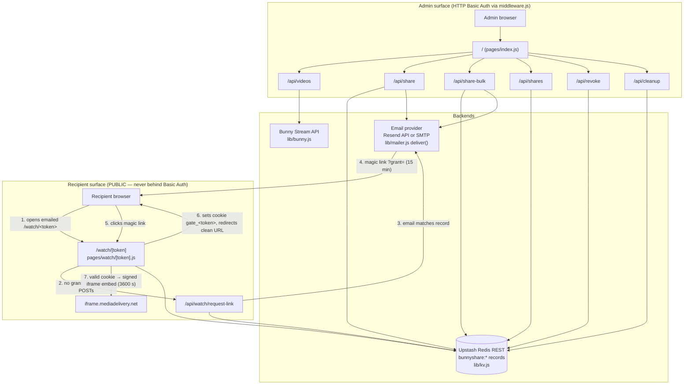

# bunny-sharing architecture contract

This is the design contract for "Bunny Video Sharing": a small Next.js (Pages
Router) app that shares private Bunny.net Stream videos with outside
recipients via time-limited, revocable, email-gated `/watch/<token>` links —
without giving recipients any Bunny library access. If you change anything
this file describes, you are changing the contract; read the matching
Decision's "What breaks" first, and route the change through
`bunny-sharing-change-control`.

Verified against the working tree at commit `5905bba` on 2026-07-18. Every
claim cites the source file; when this document and the code disagree, the
code wins — then fix this document.

Jargon, defined once:

- **share token**: 32 hex chars (`crypto.randomBytes(16).toString("hex")`,
  `lib/shares.js:13`). Identifies one share of one video to one email.
- **share record**: the JSON object at KV key `bunnyshare:<token>` — the
  single source of truth for a share (schema in section 5).
- **grant**: a stateless HMAC-signed string proving "this holder demonstrated
  control of the recipient email for this share" (`lib/gate.js`). Exists in
  two flavors: the 15-minute *magic-link grant* (emailed) and the *cookie
  grant* (lives until the share expires).
- **gate**: the whole email-verification flow (form → magic link → cookie).

## 1. System diagram



Two access factors gate playback: **possession of the URL** (unguessable
token) **and control of the inbox** (magic link). Neither alone suffices.

## 2. Load-bearing decisions

Each entry: Decision / Why / What breaks if you change it. These are not
suggestions; they are the reasons the system is safe and simple.

### 2.1 Two factors: possession-of-URL + control-of-inbox

- **Decision**: A `/watch/<token>` link alone never plays the video. The
  recipient must also complete the email gate (type the matching email,
  click the magic link). Introduced in commit `7e2c016`; enforced by
  `pages/watch/[token].js` getServerSideProps (no cookie grant → email form)
  and `pages/api/watch/request-link.js` (email must match `record.email`).
- **Why**: Links get forwarded, pasted in chats, and leaked from inboxes.
  The unguessable token stops guessing; the inbox check stops forwarding.
  A full IdP (Auth0/Clerk) was considered and rejected in `7e2c016`: none
  offers an out-of-box "one URL ↔ one email" primitive, and the self-built
  HMAC gate is ~150 lines with zero vendor dependencies.
- **What breaks**: Rendering the embed without a verified grant reduces
  security to possession-only — anyone who sees the URL watches. Requiring
  more than these two factors (accounts, passwords) breaks the "no signup
  for recipients" product premise.

### 2.2 Stateless HMAC grants instead of KV-stored sessions

- **Decision**: Grants are self-contained HMAC-SHA256-signed strings
  (`lib/gate.js`), verified with `GATE_SECRET`. Nothing about a grant is
  stored server-side.
- **Why**: Zero storage and zero cleanup for sessions. Revocation is
  inherited for free: every request to `/watch/<token>` re-loads the share
  record first (`pages/watch/[token].js:122-132`) and rejects
  revoked/expired shares *before* the grant is even checked — so a grant is
  only as alive as its share record.
- **What breaks — and the built-in footgun**: Rotating `GATE_SECRET`
  invalidates **all** outstanding grants at once. That is a feature (instant
  global logout if the secret leaks) AND a footgun (rotate it casually and
  every recipient silently re-verifies; magic links in flight die). If you
  move grants into KV you gain per-grant revocation but inherit storage,
  TTL bookkeeping, and a new failure surface — do not do this without a
  concrete need (see bunny-sharing-roadmap).

### 2.3 Grant lifecycle: 15-min emailed grant → cookie grant → redirect strip

- **Decision**: `request-link` signs a grant expiring in
  `MAGIC_LINK_TTL_MS = 15 * 60 * 1000` (`pages/api/watch/request-link.js:8`)
  and emails `<site>/watch/<token>?grant=<...>`. On click,
  `pages/watch/[token].js:137-155` verifies it, signs a **new** cookie grant
  whose `expiresAt` equals the share's `record.expiresAt`, sets the cookie,
  and 302-redirects to the clean `/watch/<token>` URL.
- **Why**: The emailed grant must be short-lived because email is the leaky
  channel. The cookie grant may live longer because it is HttpOnly and
  path-scoped. The redirect strips `?grant=` from the address bar and
  browser history so the emailed credential does not linger anywhere
  copyable.
- **What breaks**: Lengthening the magic-link TTL widens the interception
  window. Skipping the redirect leaves a live credential in history/referer.
  Making the cookie grant outlive the share is harmless in effect (record
  check still gates) but violates least-surprise; making it shorter forces
  pointless re-verification.

### 2.4 Cookie `gate_<token>` scoped by `Path=/watch/<token>`

- **Decision**: Cookie name is `gate_<token>` and it is set with
  `HttpOnly; Path=/watch/<token>; SameSite=Lax; Max-Age=<until share
  expiry>` plus `; Secure` when the request is https
  (`pages/watch/[token].js:104-106,145-153`).
- **Why**: Path scoping means authorization for one share never rides along
  to another share's page — the browser simply does not send it. The
  deliberate cost: a recipient with five shares verifies five times. That
  trade was chosen; per-share isolation beats convenience here.
- **What breaks**: Widening `Path` to `/watch` (or `/`) makes every cookie
  grant accompany every share page request. Verification would still fail on
  token binding (`verifyGrant(..., { token })`, `lib/gate.js:61`), but you'd
  ship cross-share credentials in every request for no reason, and a future
  verification bug becomes cross-share instead of contained. Renaming the
  cookie breaks live viewers' sessions (invariant 1).

### 2.5 Share record in KV is the truth; the Bunny embed URL is a second, short-lived signing layer

- **Decision**: Authorization lives in the KV record. Playback uses a
  separately signed Bunny embed URL — sha256 **hex** of
  `BUNNY_TOKEN_KEY + videoId + expires`, generated per page view with
  3600 s expiry (`lib/bunny.js:56-65`, called at
  `pages/watch/[token].js:171`).
- **Why**: The KV record gives revocation and audit; the Bunny token stops
  anyone from lifting the iframe `src` and hot-linking it forever. Two
  layers, two jobs.
- **Honest limit**: Revocation takes effect on the **next page load**, not
  mid-playback. A recipient already watching keeps a valid Bunny token for
  up to 3600 s after you revoke. This is accepted; shortening
  `expiresInSeconds` trades that window against playback breaking during
  long videos. Do not claim instant revocation anywhere.
- **What breaks**: Caching the embed URL in the record would freeze the
  `expires` timestamp and dead-link every share after an hour. Note the
  sibling trap: `signCdnUrl` for thumbnails uses a **different key**
  (`BUNNY_CDN_TOKEN_KEY`) and **base64url** encoding (`lib/bunny.js:40-52`)
  — mixing the two schemes was a real incident (`65dc992`); the signing math
  lives in bunny-stream-reference.

### 2.6 Bulk = N independent records; no bundle entity

- **Decision**: `/api/share-bulk` loops `createShareRecord` once per video —
  N videos → N tokens → N records → N links — and sends one consolidated
  email listing them all (`pages/api/share-bulk.js:21-42`). Falsy ids are
  skipped; all-invalid input is a 400.
- **Why**: Independent revocation per video, and zero new schema. The
  **only** grouping that exists is the email itself; there is no "bundle"
  key, id, or record anywhere in KV.
- **What breaks**: Introducing a bundle entity adds a second source of truth
  and a migration risk to `bunnyshare:*` (invariant 1). Any feature that
  assumes shares created together can be found together will find nothing —
  do not "discover" a bundle relation; it does not exist.

### 2.7 Middleware negative-lookahead matcher is the sole admin auth boundary

- **Decision**: `middleware.js` applies HTTP Basic Auth
  (`ADMIN_USER`/`ADMIN_PASS`) with matcher
  `["/", "/api/((?!watch/).*)"]` (`middleware.js:29-32`). That single regex
  is the entire admin/public split: `/` and every `/api/*` route are
  protected **except** `/api/watch/*`; `/watch/*` pages are never matched at
  all.
- **Why**: One declarative boundary instead of per-route auth checks that
  someone will forget on the next route.
- **What breaks**: Any new admin API route is protected automatically — but
  any new **public** route must be carved out of the matcher or it silently
  401s for recipients. Conversely, naming an admin route under `/api/watch/`
  exposes it unauthenticated. Note (as of 2026-07-18): the Next 16 build
  warns that the `middleware` file convention is deprecated in favor of
  `proxy`; renaming is a behavior-affecting change — do not do it casually.

### 2.8 Revoke = flag; cleanup = the only deleter

- **Decision**: `/api/revoke` sets `record.revoked = true` and writes the
  record back — never deletes (`pages/api/revoke.js:12-13`). `/api/cleanup`
  is the only code path that deletes, and only records that are
  `revoked || expired` (`pages/api/cleanup.js:9-13`).
- **Why**: Revocation stays reversible (flip the flag back by hand) and
  auditable (the record still shows who had access to what until cleanup
  runs). Separating "deny access" from "destroy evidence" means a fat-finger
  revoke is recoverable.
- **What breaks**: Making revoke delete destroys the audit trail and
  reversibility. Making cleanup delete non-expired, non-revoked records
  breaks live links (invariant 1).

### 2.9 `deliver()` is the single email chokepoint; provider is config, not code

- **Decision**: All three senders (`sendShareEmail`, `sendBulkShareEmail`,
  `sendMagicLinkEmail`) route through one `deliver({to, subject, text,
  html})` (`lib/mailer.js:32-54`). If `RESEND_API_KEY` is set → Resend HTTP
  API; otherwise nodemailer SMTP (`secure` iff port 465). Callers never know
  which.
- **Why**: Provider swap = env-var change, zero code. Guards
  (`escapeHtml`, `isValidUrl` — incident `29fb9be`) sit in the senders, so
  every email passes them regardless of provider.
- **What breaks**: A sender that bypasses `deliver()` silently forks
  provider config and dodges future cross-cutting fixes (logging, retries).
  A new email that skips `escapeHtml`/`isValidUrl` reopens the XSS /
  host-header incident (invariant 2). Provider selection and deliverability
  theory: email-delivery-reference.

## 3. Security invariants

Numbered; do not weaken any of them. "Verify" is a one-liner you can run
from the repo root to confirm it still holds.

| # | Invariant | Verify it still holds |
|---|-----------|-----------------------|
| 1 | **Never break live links** (prime directive): existing tokens, `bunnyshare:*` key prefix, record field meanings, `/watch/<token>` URL shape, and `gate_<token>` cookie name/path keep working across all changes. (Cautionary tale: `30ecd7f` silently migrated `share:` → `bunnyshare:` and orphaned old records.) | `grep -rn "bunnyshare:" lib pages` — every KV access uses the prefix; `grep -rn "gate_" pages` — cookie name unchanged |
| 2 | All user-controlled strings in email HTML pass `escapeHtml`; all links pass `isValidUrl` (`lib/mailer.js:4-22`) | `grep -n "escapeHtml\|isValidUrl" lib/mailer.js` — present in every `send*` function |
| 3 | `baseUrl` fallback is https, never the raw request scheme (`lib/shares.js:6`) | `grep -n "https://" lib/shares.js` |
| 4 | `/api/watch/request-link` returns an IDENTICAL 200 body for invalid link, mismatched email, throttled, and success (anti-enumeration) | `grep -cn "genericOk()" pages/api/watch/request-link.js` — expect 4 call sites |
| 5 | `GATE_SECRET` has no default; the gate throws if unset (`lib/gate.js:14-22`) | `grep -n "throw" lib/gate.js` — inside `secret()` |
| 6 | Grant verification uses `crypto.timingSafeEqual`; grants are token-bound and expiring (`lib/gate.js:55,60-61`) | `grep -n "timingSafeEqual\|payload.t !== token\|payload.x" lib/gate.js` |
| 7 | Middleware matcher keeps `/api/watch/*` public and everything else on the admin surface behind Basic Auth; `/watch/*` stays out of the matcher | `grep -n "matcher" middleware.js` — exactly `["/", "/api/((?!watch/).*)"]` |
| 8 | Every share has its own token; bulk N videos → N records → N independently revocable links | `grep -n "createShareRecord" pages/api/share-bulk.js` — inside the per-video loop |
| 9 | Revoke flips `revoked: true`; only cleanup deletes, and only revoked-or-expired records | `grep -n "kvDel" pages/api/*.js` — only `cleanup.js` matches |

## 4. Known weak points — honest register

Open and documented as of 2026-07-18. None is a secret; all are deliberate
scope decisions or unfinished hardening. "Candidate-fix" items live in
`bunny-sharing-roadmap` (ranked menu) and, where gate-related, in
`bunny-sharing-email-gate-campaign`.

| Weak point | Severity | Status |
|------------|----------|--------|
| Basic Auth compares plaintext env strings with `===` (`middleware.js:18`); single shared admin credential; no timing-safe compare | Medium (admin surface; attacker needs network position or many guesses) | Accepted-for-now; candidate-fix in bunny-sharing-roadmap |
| `kvKeys` uses Redis `KEYS` — O(N) full scan (`lib/kv.js:40-43`); `/api/shares` and `/api/cleanup` scan everything | Low at current scale (tens of shares); Medium if shares grow unbounded | Accepted-for-now; revisit at scale (bunny-sharing-roadmap) |
| Magic-link grant is NOT single-use within its 15-min TTL — replayable if intercepted. Mitigated: cookie exchange + redirect strips it from URL/history | Medium | Candidate-fix (top hardening item in bunny-sharing-email-gate-campaign) |
| Throttle is 30 s per share token only (`gatethrottle:<token>`); no per-IP rate limiting on `/api/watch/request-link` | Low-Medium (email-bombing across many tokens, or KV load) | Candidate-fix (bunny-sharing-roadmap) |
| No tests, no linter, no CI (two scanners were added, then deleted — see bunny-sharing-failure-archaeology). Verification is manual | Medium (process risk, not runtime risk) | Candidate-fix (bunny-sharing-validation-and-qa) |
| `share`/`share-bulk` store records BEFORE sending email; a send failure leaves a live record whose recipient never got the link | Low (admin sees the 500 and can revoke/resend) | Accepted-for-now; noted in bunny-sharing-debugging-playbook |
| The email gate has NOT been exercised against live Resend + a real inbox + prod Bunny/KV | High (unproven core flow) | Open — THE campaign: bunny-sharing-email-gate-campaign |
| Revocation is not instant: an in-flight Bunny embed token stays valid up to 3600 s after revoke (section 2.5) | Low (bounded window, by design) | Accepted-for-now |
| `GATE_SECRET` rotation is all-or-nothing (section 2.2) | Low (operational footgun, not a vuln) | Accepted-for-now; document before any rotation |

## 5. Compatibility contract: exact formats

These formats are what invariant 1 protects. Changing any field name, key
prefix, encoding, or URL shape breaks links/sessions already in the wild.

### 5.1 Share record — KV key `bunnyshare:<token>`

Created in `lib/shares.js:12-27`; stored via `kvSet` as URI-encoded JSON
over the Upstash REST API (`lib/kv.js:19-22`).

| Field | Type | Value / meaning |
|-------|------|-----------------|
| `token` | string | 32 lowercase hex chars — `crypto.randomBytes(16).toString("hex")` |
| `videoId` | string | Bunny Stream video GUID |
| `videoTitle` | string | Display title; falls back to `videoId` if absent |
| `email` | string | Recipient email **as entered** (NOT normalized at write time; normalization happens at compare time via `normalizeEmail`, `pages/api/watch/request-link.js:38`) |
| `createdAt` | number | Unix epoch **milliseconds** |
| `expiresAt` | number | Unix epoch **milliseconds**: `Date.now() + (Number(hours) || 72) * 3600 * 1000` — default 72 h |
| `revoked` | boolean | `false` at creation; flipped to `true` by `/api/revoke`; never deleted except by `/api/cleanup` |

Auxiliary key: `gatethrottle:<token>` — value `1`, Upstash `EX=30`
(`pages/api/watch/request-link.js:43-48`). Ephemeral; not part of the
compatibility contract, but keep the name stable so in-flight throttles
survive a deploy.

### 5.2 Grant string — `lib/gate.js`

Format: `<body>.<sig>` where

- `body` = base64url of `JSON.stringify({ t, e, x })`
- `sig` = base64url of `HMAC-SHA256(body, GATE_SECRET)` (raw digest bytes)
- base64url here = standard base64 with `+`→`-`, `/`→`_`, trailing `=`
  stripped (`lib/gate.js:24-26`)

Payload fields:

| Field | Type | Meaning |
|-------|------|---------|
| `t` | string | share token this grant is bound to |
| `e` | string | recipient email, normalized (`trim().toLowerCase()`) |
| `x` | number | expiry, Unix epoch **milliseconds** |

Two instantiations, same format:

| | `x` (expiry) | Where it lives |
|---|---|---|
| Magic-link grant | `Date.now() + 15 min` | `?grant=` query param in the emailed link |
| Cookie grant | `record.expiresAt` (the share's own expiry) | cookie `gate_<token>` |

Verification (`verifyGrant`, `lib/gate.js:47-66`): recompute HMAC,
`timingSafeEqual`, reject expired (`x`), reject wrong token (`t`), never
throw on malformed input — malformed returns `null`.

### 5.3 Cookie — set at `pages/watch/[token].js:150-153`

```
gate_<token>=<urlencoded grant>; HttpOnly; Path=/watch/<token>; SameSite=Lax; Max-Age=<seconds until record.expiresAt>[; Secure]
```

`Secure` is appended when `x-forwarded-proto` is https, or `SITE_URL`
starts with `https` (`pages/watch/[token].js:146-149`).

### 5.4 URL shapes

| URL | Shape | Source |
|-----|-------|--------|
| Share link | `<baseUrl>/watch/<token>` | `lib/shares.js:28` |
| Magic link | `<baseUrl>/watch/<token>?grant=<urlencoded grant>` | `pages/api/watch/request-link.js:55` |
| Embed | `https://iframe.mediadelivery.net/embed/<BUNNY_LIBRARY_ID>/<videoId>?token=<sha256 hex>&expires=<unix seconds>` | `lib/bunny.js:64` |

`baseUrl(req)` = `SITE_URL` if set, else `https://<host header>` — the
https fallback is deliberate (host-header poisoning fix, invariant 3).

## When NOT to use this skill

- **Running, deploying, cron/cleanup operation, KV conventions in
  practice** → `bunny-sharing-run-and-operate`.
- **Bunny Stream signing math, the two token-auth schemes, embed/thumbnail
  anatomy** → `bunny-stream-reference`.
- **Resend vs SMTP mechanics, STARTTLS/465, SPF/DKIM, deliverability
  triage** → `email-delivery-reference`.
- **What happened historically and why (incident narratives)** →
  `bunny-sharing-failure-archaeology`.
- **Whether/how to make a change safely** → `bunny-sharing-change-control`
  (this skill tells you what must not break; that one tells you how to
  change things anyway).
- **Env-var catalog and from-scratch setup** → `bunny-sharing-env-and-setup`.

## Provenance and maintenance

Written 2026-07-18 against branch `claude/bulk-share-separate-links-auth-cblrle`
at commit `5905bba`, by direct reading of: `middleware.js`, `lib/gate.js`,
`lib/shares.js`, `lib/kv.js`, `lib/bunny.js`, `lib/mailer.js`,
`pages/watch/[token].js`, `pages/api/share.js`, `pages/api/share-bulk.js`,
`pages/api/watch/request-link.js`, `pages/api/shares.js`,
`pages/api/revoke.js`, `pages/api/cleanup.js`, `pages/api/videos.js`.

Re-verify volatile facts before trusting them:

```bash
git log --oneline -3                                  # still at/after 5905bba?
grep -n "matcher" middleware.js                        # section 2.7 / invariant 7
grep -n "MAGIC_LINK_TTL_MS\|THROTTLE_SECONDS" pages/api/watch/request-link.js   # section 2.3
grep -n "randomBytes\|expiresAt\|revoked" lib/shares.js                         # section 5.1
grep -n "b64url\|timingSafeEqual" lib/gate.js                                   # section 5.2
grep -n "Path=/watch" "pages/watch/[token].js"                                  # section 5.3
grep -n "generateEmbedUrl(record.videoId" "pages/watch/[token].js"              # section 2.5 (3600 s)
grep -n "RESEND_API_KEY" lib/mailer.js                                          # section 2.9
```

If any grep comes back changed or empty, the contract has drifted: read the
file, update the relevant section here, and check whether an invariant was
weakened (if so, escalate per bunny-sharing-change-control).
