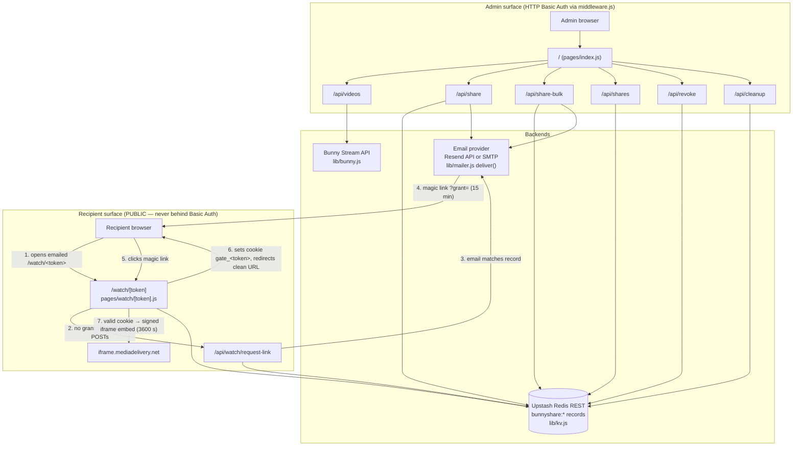

# bunny-sharing architecture contract

This is the design contract for "Bunny Video Sharing": a small Next.js (Pages
Router) app that shares private Bunny.net Stream videos with outside
recipients via time-limited, revocable, email-gated `/watch/<token>` links —
without giving recipients any Bunny library access. If you change anything
this file describes, you are changing the contract; read the matching
Decision's "What breaks" first, and route the change through
`bunny-sharing-change-control`.

Verified against the working tree at commit `5905bba` on 2026-07-18. Every
claim cites the source file; when this document and the code disagree, the
code wins — then fix this document.

Jargon, defined once:

- **share token**: 32 hex chars (`crypto.randomBytes(16).toString("hex")`,
  `lib/shares.js:13`). Identifies one share of one video to one email.
- **share record**: the JSON object at KV key `bunnyshare:<token>` — the
  single source of truth for a share (schema in section 5).
- **grant**: a stateless HMAC-signed string proving "this holder demonstrated
  control of the recipient email for this share" (`lib/gate.js`). Exists in
  two flavors: the 15-minute *magic-link grant* (emailed) and the *cookie
  grant* (lives until the share expires).
- **gate**: the whole email-verification flow (form → magic link → cookie).

## 1. System diagram



Two access factors gate playback: **possession of the URL** (unguessable
token) **and control of the inbox** (magic link). Neither alone suffices.

## 2. Load-bearing decisions

Each entry: Decision / Why / What breaks if you change it. These are not
suggestions; they are the reasons the system is safe and simple.

### 2.1 Two factors: possession-of-URL + control-of-inbox

- **Decision**: A `/watch/<token>` link alone never plays the video. The
  recipient must also complete the email gate (type the matching email,
  click the magic link). Introduced in commit `7e2c016`; enforced by
  `pages/watch/[token].js` getServerSideProps (no cookie grant → email form)
  and `pages/api/watch/request-link.js` (email must match `record.email`).
- **Why**: Links get forwarded, pasted in chats, and leaked from inboxes.
  The unguessable token stops guessing; the inbox check stops forwarding.
  A full IdP (Auth0/Clerk) was considered and rejected in `7e2c016`: none
  offers an out-of-box "one URL ↔ one email" primitive, and the self-built
  HMAC gate is ~150 lines with zero vendor dependencies.
- **What breaks**: Rendering the embed without a verified grant reduces
  security to possession-only — anyone who sees the URL watches. Requiring
  more than these two factors (accounts, passwords) breaks the "no signup
  for recipients" product premise.

### 2.2 Stateless HMAC grants instead of KV-stored sessions

- **Decision**: Grants are self-contained HMAC-SHA256-signed strings
  (`lib/gate.js`), verified with `GATE_SECRET`. Nothing about a grant is
  stored server-side.
- **Why**: Zero storage and zero cleanup for sessions. Revocation is
  inherited for free: every request to `/watch/<token>` re-loads the share
  record first (`pages/watch/[token].js:122-132`) and rejects
  revoked/expired shares *before* the grant is even checked — so a grant is
  only as alive as its share record.
- **What breaks — and the built-in footgun**: Rotating `GATE_SECRET`
  invalidates **all** outstanding grants at once. That is a feature (instant
  global logout if the secret leaks) AND a footgun (rotate it casually and
  every recipient silently re-verifies; magic links in flight die). If you
  move grants into KV you gain per-grant revocation but inherit storage,
  TTL bookkeeping, and a new failure surface — do not do this without a
  concrete need (see bunny-sharing-roadmap).

### 2.3 Grant lifecycle: 15-min emailed grant → cookie grant → redirect strip

- **Decision**: `request-link` signs a grant expiring in
  `MAGIC_LINK_TTL_MS = 15 * 60 * 1000` (`pages/api/watch/request-link.js:8`)
  and emails `<site>/watch/<token>?grant=<...>`. On click,
  `pages/watch/[token].js:137-155` verifies it, signs a **new** cookie grant
  whose `expiresAt` equals the share's `record.expiresAt`, sets the cookie,
  and 302-redirects to the clean `/watch/<token>` URL.
- **Why**: The emailed grant must be short-lived because email is the leaky
  channel. The cookie grant may live longer because it is HttpOnly and
  path-scoped. The redirect strips `?grant=` from the address bar and
  browser history so the emailed credential does not linger anywhere
  copyable.
- **What breaks**: Lengthening the magic-link TTL widens the interception
  window. Skipping the redirect leaves a live credential in history/referer.
  Making the cookie grant outlive the share is harmless in effect (record
  check still gates) but violates least-surprise; making it shorter forces
  pointless re-verification.

### 2.4 Cookie `gate_<token>` scoped by `Path=/watch/<token>`

- **Decision**: Cookie name is `gate_<token>` and it is set with
  `HttpOnly; Path=/watch/<token>; SameSite=Lax; Max-Age=<until share
  expiry>` plus `; Secure` when the request is https
  (`pages/watch/[token].js:104-106,145-153`).
- **Why**: Path scoping means authorization for one share never rides along
  to another share's page — the browser simply does not send it. The
  deliberate cost: a recipient with five shares verifies five times. That
  trade was chosen; per-share isolation beats convenience here.
- **What breaks**: Widening `Path` to `/watch` (or `/`) makes every cookie
  grant accompany every share page request. Verification would still fail on
  token binding (`verifyGrant(..., { token })`, `lib/gate.js:61`), but you'd
  ship cross-share credentials in every request for no reason, and a future
  verification bug becomes cross-share instead of contained. Renaming the
  cookie breaks live viewers' sessions (invariant 1).

### 2.5 Share record in KV is the truth; the Bunny embed URL is a second, short-lived signing layer

- **Decision**: Authorization lives in the KV record. Playback uses a
  separately signed Bunny embed URL — sha256 **hex** of
  `BUNNY_TOKEN_KEY + videoId + expires`, generated per page view with
  3600 s expiry (`lib/bunny.js:56-65`, called at
  `pages/watch/[token].js:171`).
- **Why**: The KV record gives revocation and audit; the Bunny token stops
  anyone from lifting the iframe `src` and hot-linking it forever. Two
  layers, two jobs.
- **Honest limit**: Revocation takes effect on the **next page load**, not
  mid-playback. A recipient already watching keeps a valid Bunny token for
  up to 3600 s after you revoke. This is accepted; shortening
  `expiresInSeconds` trades that window against playback breaking during
  long videos. Do not claim instant revocation anywhere.
- **What breaks**: Caching the embed URL in the record would freeze the
  `expires` timestamp and dead-link every share after an hour. Note the
  sibling trap: `signCdnUrl` for thumbnails uses a **different key**
  (`BUNNY_CDN_TOKEN_KEY`) and **base64url** encoding (`lib/bunny.js:40-52`)
  — mixing the two schemes was a real incident (`65dc992`); the signing math
  lives in bunny-stream-reference.

### 2.6 Bulk = M×N independent records; bundle is a pure grouping list, never a second source of truth

- **Decision**: `/api/share-bulk` accepts multiple recipients (`emails`
  array; legacy single `email` still accepted) and loops `createShareRecord`
  once per recipient × video pair — M recipients × N videos → M×N tokens →
  M×N records. Each recipient gets ONE consolidated email listing only their
  own links (`pages/api/share-bulk.js`). Falsy video ids are skipped;
  all-invalid input is a 400; a per-recipient email failure is reported in
  the response (`failures`) without failing other recipients.
- **Why**: Independent revocation per person per video, per-person view
  tracking (section 5.1 view fields), and zero new schema for the shares
  themselves. Revoking or letting one member expire never touches any other
  record.
- **Bundle addition (2026-07-20 — see section 5.1a):** every `share-bulk`
  call, and every `share.js` call too (widened same day — see below),
  creates or extends one `bunnybundle:<id>` record per recipient
  (`lib/bundles.js`), listing that recipient's member tokens, and a
  `/bundle/<id>` gated page (`pages/bundle/[bundleId].js`) that lists them.
  The bundle record holds ONLY the token list, email, and its own
  `createdAt`/`expiresAt` (max of members) — it never stores a member's
  title, revoked flag, or status. `getBundleMembers` (`lib/bundles.js`)
  always re-reads each `bunnyshare:<token>` live, so the bundle page can
  never show stale status; there is exactly one source of truth for a
  share's state (invariant 1 still holds).
- **One bundle per email, not per call (widened same day):**
  `findOrExtendBundle` (`lib/bundles.js`) looks for an existing, still-active
  bundle whose `email` matches (normalized) before creating a new one. If
  found, it appends the new members' tokens and extends `expiresAt` to the
  later of the two — so a recipient shared with across several separate
  admin actions (single share today, bulk share next week) keeps exactly ONE
  bundle page/link for their entire relationship with this deployment,
  rather than accumulating a new bundle every time. If NOT found (first time
  this email has ever been shared with, or their prior bundle expired), it
  also sweeps in any other still-active `bunnyshare:*` records for that
  email not already claimed by another bundle (e.g. single-video shares made
  before this widening existed) — so the first bundle for someone reflects
  everything currently shared with them, not just what's new. `/api/share.js`
  now always calls this too: a recipient's first share still gets the plain
  single-video email (`sendShareEmail`), but the moment they have more than
  one active share (from ANY endpoint, in ANY order), every subsequent
  notification uses `getBundleItems` to build ONE consolidated email
  (`sendBulkShareEmail`) listing everything currently active for them,
  instead of firing a new standalone email per share. This is a policy
  choice, not a security property: the effect is "recipient's active shares
  converge to one bundle and one running conversation," which is what was
  asked for ("if they are the same email, they should be in the same
  email").
- **Bundle gate is a second application of the same mechanism, not a bypass**:
  the bundle page is gated by the identical stateless-HMAC magic-link
  mechanism (section 2.2), scoped to a `bundle:<id>` pseudo-token that can
  never collide with a real 32-hex video token. The one difference from a
  single-video gate: on successful verification, the exchange mints not only
  a `gate_bundle_<id>` cookie (Path=`/bundle/<id>`) but also a `gate_<token>`
  cookie for EVERY member (Path=`/watch/<token>`, same format the per-video
  gate already produces) — this is the bundle's actual value (one
  verification, not N), and it works by minting standard per-video cookies,
  not by changing what `/watch/[token].js` accepts. Every video still
  independently re-checks `revoked`/`expiresAt` on every render regardless of
  cookie presence (section 2.4/2.5) — a bundle cookie shortcuts the email
  round-trip, never the live status check.
- **What breaks**: Treating the bundle record as authoritative for a
  member's status (instead of re-reading `bunnyshare:<token>`) reintroduces
  the second-source-of-truth risk this design deliberately avoids. Any code
  path that reads `bundle.tokens` and does NOT re-fetch each `bunnyshare:`
  record before showing title/status is wrong. `findOrExtendBundle` does a
  full `KEYS bunnybundle:*` AND `KEYS bunnyshare:*` scan on every call where
  no active bundle is found yet for that email (the orphan sweep) — extends
  the KEYS-scan performance profile (roadmap item a) to `/api/share.js` too,
  not just admin listing/cleanup; accepted at current scale, revisit
  together. Also note: if a recipient already unlocked a bundle (has a valid
  `gate_bundle_<id>` cookie) and a NEW share is later folded into that same
  bundle, the new video appears in the listing immediately but has no
  per-video `gate_<token>` cookie yet — no per-video cookies are minted
  outside a fresh grant exchange (section 2.3/5.2), so clicking it correctly
  falls back to that video's own email gate. Graceful degradation, not a
  bug.

### 2.7 Middleware negative-lookahead matcher is the sole admin auth boundary

- **Decision**: `middleware.js` applies HTTP Basic Auth
  (`ADMIN_USER`/`ADMIN_PASS`) with matcher
  `["/", "/api/((?!watch/|bundle/).*)"]` (`middleware.js:29-32`, widened
  2026-07-20 to add `bundle/`). That single regex is the entire admin/public
  split: `/` and every `/api/*` route are protected **except**
  `/api/watch/*` and `/api/bundle/*`; `/watch/*` and `/bundle/*` pages are
  never matched at all (Next only runs middleware on paths named in
  `matcher`).
- **Why**: One declarative boundary instead of per-route auth checks that
  someone will forget on the next route.
- **What breaks**: Any new admin API route is protected automatically — but
  any new **public** route must be carved out of the matcher or it silently
  401s for recipients. Conversely, naming an admin route under `/api/watch/`
  or `/api/bundle/` exposes it unauthenticated — those two prefixes must stay
  recipient-only, never grow an admin sub-route. Note (as of 2026-07-18): the
  Next 16 build warns that the `middleware` file convention is deprecated in
  favor of `proxy`; renaming is a behavior-affecting change — do not do it
  casually.

### 2.8 Revoke = flag; cleanup = the only deleter

- **Decision**: `/api/revoke` sets `record.revoked = true` and writes the
  record back — never deletes (`pages/api/revoke.js:12-13`). `/api/cleanup`
  is the only code path that deletes, and only records that are
  `revoked || expired` (`pages/api/cleanup.js:9-13`).
- **Why**: Revocation stays reversible (flip the flag back by hand) and
  auditable (the record still shows who had access to what until cleanup
  runs). Separating "deny access" from "destroy evidence" means a fat-finger
  revoke is recoverable.
- **What breaks**: Making revoke delete destroys the audit trail and
  reversibility. Making cleanup delete non-expired, non-revoked records
  breaks live links (invariant 1).

### 2.9 `deliver()` is the single email chokepoint; provider is config, not code

- **Decision**: All three senders (`sendShareEmail`, `sendBulkShareEmail`,
  `sendMagicLinkEmail`) route through one `deliver({to, subject, text,
  html})` (`lib/mailer.js:32-54`). If `RESEND_API_KEY` is set → Resend HTTP
  API; otherwise nodemailer SMTP (`secure` iff port 465). Callers never know
  which.
- **Why**: Provider swap = env-var change, zero code. Guards
  (`escapeHtml`, `isValidUrl` — incident `29fb9be`) sit in the senders, so
  every email passes them regardless of provider.
- **What breaks**: A sender that bypasses `deliver()` silently forks
  provider config and dodges future cross-cutting fixes (logging, retries).
  A new email that skips `escapeHtml`/`isValidUrl` reopens the XSS /
  host-header incident (invariant 2). Provider selection and deliverability
  theory: email-delivery-reference.

## 3. Security invariants

Numbered; do not weaken any of them. "Verify" is a one-liner you can run
from the repo root to confirm it still holds.

| # | Invariant | Verify it still holds |
|---|-----------|-----------------------|
| 1 | **Never break live links** (prime directive): existing tokens, `bunnyshare:*` key prefix, record field meanings, `/watch/<token>` URL shape, and `gate_<token>` cookie name/path keep working across all changes. (Cautionary tale: `30ecd7f` silently migrated `share:` → `bunnyshare:` and orphaned old records.) | `grep -rn "bunnyshare:" lib pages` — every KV access uses the prefix; `grep -rn "gate_" pages` — cookie name unchanged |
| 2 | All user-controlled strings in email HTML pass `escapeHtml`; all links pass `isValidUrl` (`lib/mailer.js:4-22`) | `grep -n "escapeHtml\|isValidUrl" lib/mailer.js` — present in every `send*` function |
| 3 | `baseUrl` fallback is https, never the raw request scheme (`lib/shares.js:6`) | `grep -n "https://" lib/shares.js` |
| 4 | `/api/watch/request-link` returns an IDENTICAL 200 body for invalid link, mismatched email, throttled, and success (anti-enumeration) | `grep -cn "genericOk()" pages/api/watch/request-link.js` — expect 4 call sites |
| 5 | `GATE_SECRET` has no default; the gate throws if unset (`lib/gate.js:14-22`) | `grep -n "throw" lib/gate.js` — inside `secret()` |
| 6 | Grant verification uses `crypto.timingSafeEqual`; grants are token-bound and expiring (`lib/gate.js:55,60-61`) | `grep -n "timingSafeEqual\|payload.t !== token\|payload.x" lib/gate.js` |
| 7 | Middleware matcher keeps `/api/watch/*` public and everything else on the admin surface behind Basic Auth; `/watch/*` stays out of the matcher | `grep -n "matcher" middleware.js` — exactly `["/", "/api/((?!watch/).*)"]` |
| 8 | Every share has its own token; bulk M recipients × N videos → M×N records, each independently revocable | `grep -n "createShareRecord" pages/api/share-bulk.js` — inside the per-recipient, per-video loops |
| 9 | Revoke flips `revoked: true`; only cleanup deletes, and only revoked-or-expired records | `grep -n "kvDel" pages/api/*.js` — only `cleanup.js` matches |

## 4. Known weak points — honest register

Open and documented as of 2026-07-18. None is a secret; all are deliberate
scope decisions or unfinished hardening. "Candidate-fix" items live in
`bunny-sharing-roadmap` (ranked menu) and, where gate-related, in
`bunny-sharing-email-gate-campaign`.

| Weak point | Severity | Status |
|------------|----------|--------|
| Basic Auth compares plaintext env strings with `===` (`middleware.js:18`); single shared admin credential; no timing-safe compare | Medium (admin surface; attacker needs network position or many guesses) | Accepted-for-now; candidate-fix in bunny-sharing-roadmap |
| `kvKeys` uses Redis `KEYS` — O(N) full scan (`lib/kv.js:40-43`); `/api/shares` and `/api/cleanup` scan everything | Low at current scale (tens of shares); Medium if shares grow unbounded | Accepted-for-now; revisit at scale (bunny-sharing-roadmap) |
| Magic-link grant is NOT single-use within its 15-min TTL — replayable if intercepted. Mitigated: cookie exchange + redirect strips it from URL/history | Medium | Candidate-fix (top hardening item in bunny-sharing-email-gate-campaign) |
| Throttle is 30 s per share token only (`gatethrottle:<token>`); no per-IP rate limiting on `/api/watch/request-link` | Low-Medium (email-bombing across many tokens, or KV load) | Candidate-fix (bunny-sharing-roadmap) |
| No tests, no linter, no CI (two scanners were added, then deleted — see bunny-sharing-failure-archaeology). Verification is manual | Medium (process risk, not runtime risk) | Candidate-fix (bunny-sharing-validation-and-qa) |
| `share`/`share-bulk` store records BEFORE sending email; a send failure leaves a live record whose recipient never got the link | Low | Fixed 2026-07-20: failed sends are flagged (`emailFailed`/`emailError`, additive fields) instead of silently existing, and an admin "Resend" button re-sends and clears the flag — see section 5.1. Resend (`/api/share/resend`, `pages/api/share/resend.js` exporting `resendOne`) is not gated on `emailFailed` — any active share can be re-sent on demand, and `/api/share/resend-bulk` does the same for multiple selected shares in one call (admin selects rows via checkboxes in the shares table) |
| The email gate has NOT been exercised against live Resend + a real inbox + prod Bunny/KV | High (unproven core flow) | Open — THE campaign: bunny-sharing-email-gate-campaign |
| Revocation is not instant: an in-flight Bunny embed token stays valid up to 3600 s after revoke (section 2.5) | Low (bounded window, by design) | Accepted-for-now |
| `GATE_SECRET` rotation is all-or-nothing (section 2.2) | Low (operational footgun, not a vuln) | Accepted-for-now; document before any rotation |

## 5. Compatibility contract: exact formats

These formats are what invariant 1 protects. Changing any field name, key
prefix, encoding, or URL shape breaks links/sessions already in the wild.

### 5.1 Share record — KV key `bunnyshare:<token>`

Created in `lib/shares.js:12-27`; stored via `kvSet` as URI-encoded JSON
over the Upstash REST API (`lib/kv.js:19-22`).

| Field | Type | Value / meaning |
|-------|------|-----------------|
| `token` | string | 32 lowercase hex chars — `crypto.randomBytes(16).toString("hex")` |
| `videoId` | string | Bunny Stream video GUID |
| `videoTitle` | string | Display title; falls back to `videoId` if absent |
| `email` | string | Exactly ONE recipient address per record — `parseEmails` (lib/shares.js) splits comma/semicolon/whitespace-joined input at the API boundary and both share endpoints fan out one record per address. NOT normalized at write time; the gate normalizes at compare time and (for legacy records that stored a combined string — see failure-archaeology Episode 9) matches the typed address against any address found in the stored string |
| `createdAt` | number | Unix epoch **milliseconds** |
| `expiresAt` | number | Unix epoch **milliseconds**: `Date.now() + (Number(hours) || 72) * 3600 * 1000` — default 72 h |
| `revoked` | boolean | `false` at creation; flipped to `true` by `/api/revoke`; never deleted except by `/api/cleanup` |
| `viewCount` | number (optional) | Authorized page renders. ADDITIVE (added after 5905bba): absent on older records — read as `record.viewCount \|\| 0`, never assume present |
| `firstViewedAt` | number (optional) | Unix ms of first authorized render; additive, may be absent |
| `lastViewedAt` | number (optional) | Unix ms of latest authorized render; additive, may be absent |

| `playCount` | number (optional) | Real playback starts reported by the player; additive |
| `firstPlayedAt` / `lastPlayedAt` | number (optional) | Unix ms; additive |
| `maxProgressPct` | number (optional) | Furthest playback progress 0-100, monotonic (server takes max) |
| `completedAt` | number (optional) | Unix ms of first `ended` event; additive |
| `emailFailed` | boolean (optional) | Set `true` by `share.js`/`share-bulk.js` when the notification email failed to send (record still created; link still live). Set via `setEmailFailed` (lib/shares.js), which stores `undefined` (dropped from JSON, not written as `false`) to clear it rather than leaving a stale flag — absence means "no known failure", not "definitely sent" |
| `emailError` | string (optional) | The failed send's error message, for the admin table tooltip; cleared alongside `emailFailed` |

View fields are written by `pages/watch/[token].js` only on the AUTHORIZED
branch (valid cookie grant → embed render) — never for the email form or a
magic-link exchange. Playback fields are written by `/api/watch/track`
(public route) from Player.js events the Bunny embed emits via postMessage;
the client listener lives in the watch page's `Player` component. Track
calls must carry a **tracking grant** — a normal token-bound grant, capped
at min(6 h, share expiry), signed during the authorized SSR render and
passed as a page prop (the gate cookie is Path-scoped + HttpOnly, so client
JS cannot present it; the tracking grant is the sanctioned bridge). This
means playback counters cannot be inflated without having passed the email
gate. Last-writer-wins on concurrent updates (accepted at this scale).
One record per recipient × video means views AND playback are attributable
per person. Note: Player.js event delivery from the Bunny embed is
code-complete but not yet observed live (campaign P3 item); if events never
arrive, view tracking still works and playback columns simply stay empty.

Auxiliary key: `gatethrottle:<token>` — value `1`, Upstash `EX=30`
(`pages/api/watch/request-link.js:43-48`). Ephemeral; not part of the
compatibility contract, but keep the name stable so in-flight throttles
survive a deploy.

### 5.1a Bundle record — KV key `bunnybundle:<bundleId>`

Created in `lib/bundles.js` (`createBundleRecord`, or `findOrExtendBundle`
which extends an existing one instead when found) by BOTH
`pages/api/share-bulk.js` and `pages/api/share.js` (widened 2026-07-20) —
one bundle per email that ever gets a share, kept alive and extended across
however many separate calls touch that email, not one bundle per call.

| Field | Type | Value / meaning |
|-------|------|-----------------|
| `id` | string | 32 lowercase hex chars — same generation as a share token, but a distinct KV namespace (`bunnybundle:`, never `bunnyshare:`) |
| `email` | string | The one recipient this bundle belongs to, as first typed (not normalized) — `findOrExtendBundle` matches with `normalizeEmail` for lookup, but never rewrites this field on an existing bundle |
| `tokens` | array of string | The member share tokens (`bunnyshare:<token>` keys); grows via `findOrExtendBundle` as more shares are created for this email; never shrinks (a revoked/expired member stays listed, just filtered out live by `getBundleMembers`/`getBundleItems`) |
| `createdAt` | number | Unix epoch milliseconds — set once, at first creation, never updated on extend |
| `expiresAt` | number | `Math.max(...members.map(m => m.expiresAt))` at creation, re-maxed against new members on every extend — the bundle listing itself is considered expired once every member would be, individually |

Deliberately absent: `videoTitle`, `revoked`, any per-member status. A
bundle is a grouping list, not a share — `getBundleMembers` (`lib/bundles.js`)
re-fetches each `bunnyshare:<token>` on every render (see section 2.6); this
record must never be extended with a field that duplicates something a
member record already owns.

Auxiliary key: `bundlethrottle:<bundleId>` — same shape and purpose as
`gatethrottle:<token>` but for `/api/bundle/request-link.js`. Ephemeral.

`pages/api/cleanup.js` deletes `bunnybundle:*` records once
`Date.now() > record.expiresAt` (no `revoked` check — bundles have no such
flag); this is the only code path that deletes them.

### 5.2 Grant string — `lib/gate.js`

Format: `<body>.<sig>` where

- `body` = base64url of `JSON.stringify({ t, e, x })`
- `sig` = base64url of `HMAC-SHA256(body, GATE_SECRET)` (raw digest bytes)
- base64url here = standard base64 with `+`→`-`, `/`→`_`, trailing `=`
  stripped (`lib/gate.js:24-26`)

Payload fields:

| Field | Type | Meaning |
|-------|------|---------|
| `t` | string | share token this grant is bound to — OR, for a bundle grant, the literal string `bundle:<bundleId>` (`pages/api/bundle/request-link.js`, `pages/bundle/[bundleId].js`). `verifyGrant` does plain string equality on `t`, so a bundle grant can never verify against a real video token and vice versa — no schema change to `lib/gate.js` was needed to add bundles |
| `e` | string | recipient email, normalized (`trim().toLowerCase()`) |
| `x` | number | expiry, Unix epoch **milliseconds** |

Four instantiations, same format:

| | `t` | `x` (expiry) | Where it lives |
|---|---|---|---|
| Magic-link grant | `<token>` | `Date.now() + 15 min` | `?grant=` query param in the emailed link |
| Cookie grant | `<token>` | `record.expiresAt` (the share's own expiry) | cookie `gate_<token>` |
| Bundle magic-link grant | `bundle:<bundleId>` | `Date.now() + 15 min` | `?grant=` query param on `/bundle/<bundleId>` |
| Bundle cookie grant | `bundle:<bundleId>` | `bundle.expiresAt` | cookie `gate_bundle_<bundleId>` |

On a successful bundle grant exchange (`pages/bundle/[bundleId].js`), the
per-video **cookie grant** row above is minted for every member token too —
same format as a direct single-video gate exchange produces, just minted N
times in one response instead of once (see section 2.6).

Verification (`verifyGrant`, `lib/gate.js:47-66`): recompute HMAC,
`timingSafeEqual`, reject expired (`x`), reject wrong token (`t`), never
throw on malformed input — malformed returns `null`.

### 5.3 Cookie — set at `pages/watch/[token].js:150-153`

```
gate_<token>=<urlencoded grant>; HttpOnly; Path=/watch/<token>; SameSite=Lax; Max-Age=<seconds until record.expiresAt>[; Secure]
```

`Secure` is appended when `x-forwarded-proto` is https, or `SITE_URL`
starts with `https` (`pages/watch/[token].js:146-149`).

The bundle listing cookie follows the identical shape, scoped to the bundle
path instead (`pages/bundle/[bundleId].js`):

```
gate_bundle_<bundleId>=<urlencoded grant>; HttpOnly; Path=/bundle/<bundleId>; SameSite=Lax; Max-Age=<seconds until bundle.expiresAt>[; Secure]
```

Both cookie names are distinct (`gate_` vs `gate_bundle_`) and both use
distinct Path scopes, so there is no name or scope collision even though a
`bundleId` and a video `token` are both 32 lowercase hex chars.

### 5.4 URL shapes

| URL | Shape | Source |
|-----|-------|--------|
| Share link | `<baseUrl>/watch/<token>` | `lib/shares.js:28` |
| Magic link | `<baseUrl>/watch/<token>?grant=<urlencoded grant>` | `pages/api/watch/request-link.js:55` |
| Bundle link | `<baseUrl>/bundle/<bundleId>` | `lib/bundles.js` `createBundleRecord` |
| Bundle magic link | `<baseUrl>/bundle/<bundleId>?grant=<urlencoded grant>` | `pages/api/bundle/request-link.js` |
| Embed | `https://iframe.mediadelivery.net/embed/<BUNNY_LIBRARY_ID>/<videoId>?token=<sha256 hex>&expires=<unix seconds>` | `lib/bunny.js:64` |

`baseUrl(req)` = `SITE_URL` if set, else `https://<host header>` — the
https fallback is deliberate (host-header poisoning fix, invariant 3).

## When NOT to use this skill

- **Running, deploying, cron/cleanup operation, KV conventions in
  practice** → `bunny-sharing-run-and-operate`.
- **Bunny Stream signing math, the two token-auth schemes, embed/thumbnail
  anatomy** → `bunny-stream-reference`.
- **Resend vs SMTP mechanics, STARTTLS/465, SPF/DKIM, deliverability
  triage** → `email-delivery-reference`.
- **What happened historically and why (incident narratives)** →
  `bunny-sharing-failure-archaeology`.
- **Whether/how to make a change safely** → `bunny-sharing-change-control`
  (this skill tells you what must not break; that one tells you how to
  change things anyway).
- **Env-var catalog and from-scratch setup** → `bunny-sharing-env-and-setup`.

## Provenance and maintenance

Written 2026-07-18 against branch `claude/bulk-share-separate-links-auth-cblrle`
at commit `5905bba`, by direct reading of: `middleware.js`, `lib/gate.js`,
`lib/shares.js`, `lib/kv.js`, `lib/bunny.js`, `lib/mailer.js`,
`pages/watch/[token].js`, `pages/api/share.js`, `pages/api/share-bulk.js`,
`pages/api/watch/request-link.js`, `pages/api/shares.js`,
`pages/api/revoke.js`, `pages/api/cleanup.js`, `pages/api/videos.js`.
Sections 2.6, 2.7, 5.1a, 5.2-5.4 updated 2026-07-20 for the bundle feature
(`lib/bundles.js`, `pages/bundle/[bundleId].js`,
`pages/api/bundle/request-link.js`), verified live against a mock KV + mock
SMTP (see bunny-sharing-roadmap item h for the observation log). Section 2.6
and 5.1a updated again same day when bundles were widened from "one per
bulk-share call" to "one per email, extended across calls, including
single-share" (`findOrExtendBundle`, `getBundleItems` in `lib/bundles.js`;
`pages/api/share.js` now participates) — see bunny-sharing-roadmap item h's
follow-up entry for the observation log.

Re-verify volatile facts before trusting them:

```bash
git log --oneline -3                                  # still at/after 5905bba, plus the bundle commit?
grep -n "matcher" middleware.js                        # section 2.7 / invariant 7 — expect (?!watch/|bundle/)
grep -n "MAGIC_LINK_TTL_MS\|THROTTLE_SECONDS" pages/api/watch/request-link.js   # section 2.3
grep -n "randomBytes\|expiresAt\|revoked" lib/shares.js                         # section 5.1
grep -n "b64url\|timingSafeEqual" lib/gate.js                                   # section 5.2
grep -n "Path=/watch" "pages/watch/[token].js"                                  # section 5.3
grep -n "generateEmbedUrl(record.videoId" "pages/watch/[token].js"              # section 2.5 (3600 s)
grep -n "RESEND_API_KEY" lib/mailer.js                                          # section 2.9
grep -n "bunnybundle:\|getBundleMembers" lib/bundles.js                         # section 2.6 / 5.1a
grep -n "gate_bundle_\|Path=/bundle" "pages/bundle/[bundleId].js"               # section 5.3 bundle cookie
grep -n "findOrExtendBundle" lib/bundles.js pages/api/share.js pages/api/share-bulk.js  # one-bundle-per-email widening
```

If any grep comes back changed or empty, the contract has drifted: read the
file, update the relevant section here, and check whether an invariant was
weakened (if so, escalate per bunny-sharing-change-control).
